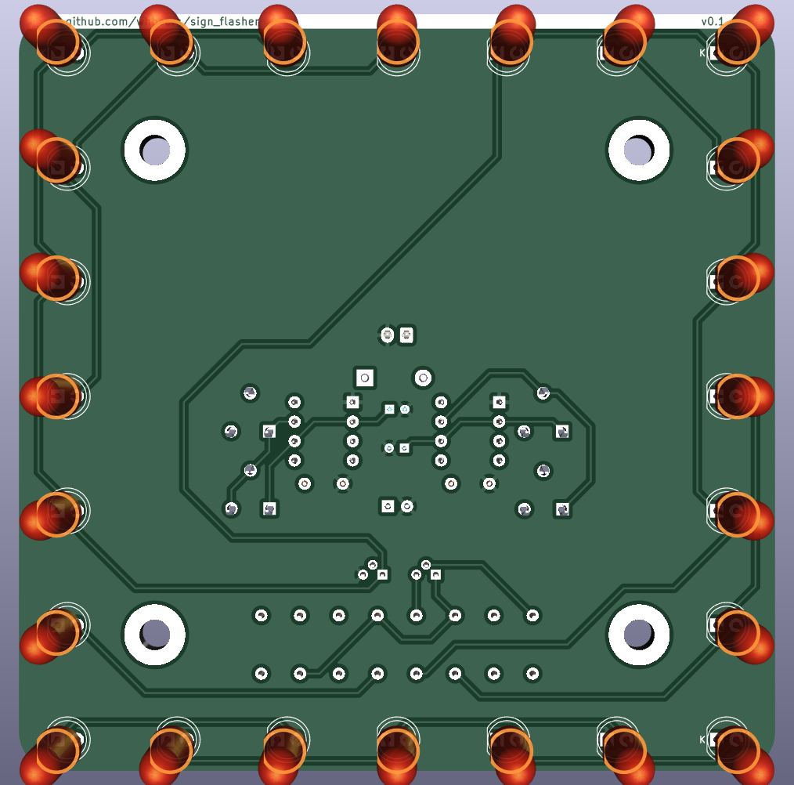

# FET-driven LED flasher

This is a simple LED driver circuit using two 555s and a couple FETs to drive several LEDs meant to outline a small "sign". Thee-creation of the DOD Overdrive 250 / MXR Distortion+ op-amp drive circuit, as a first attempt at basic PCB design in [KiCAD](https://www.kicad.org/). 

[Schematic PDF](schematics/signflasher-latest.pdf)

## Credit
The underlying circuit is based on [a 555 schematic](https://mechatrofice.com/circuits/555/led-flasher-circuit) I found when searching for related designs.

## Versioning

My pcb designs utilize the following versioning scheme (I'll add to this as I produce more revisions):
 - v0.0XX: A candidate design that has not yet been produced and tested.
 - v0.XX: A design that has been produced, tested, and any initial errors addressed.
